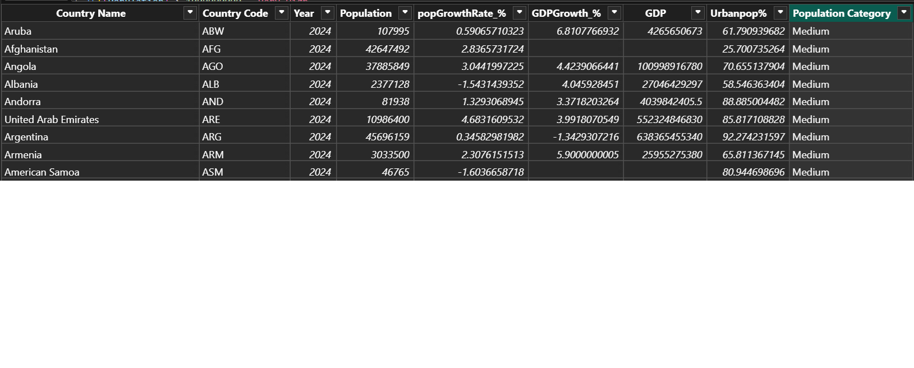
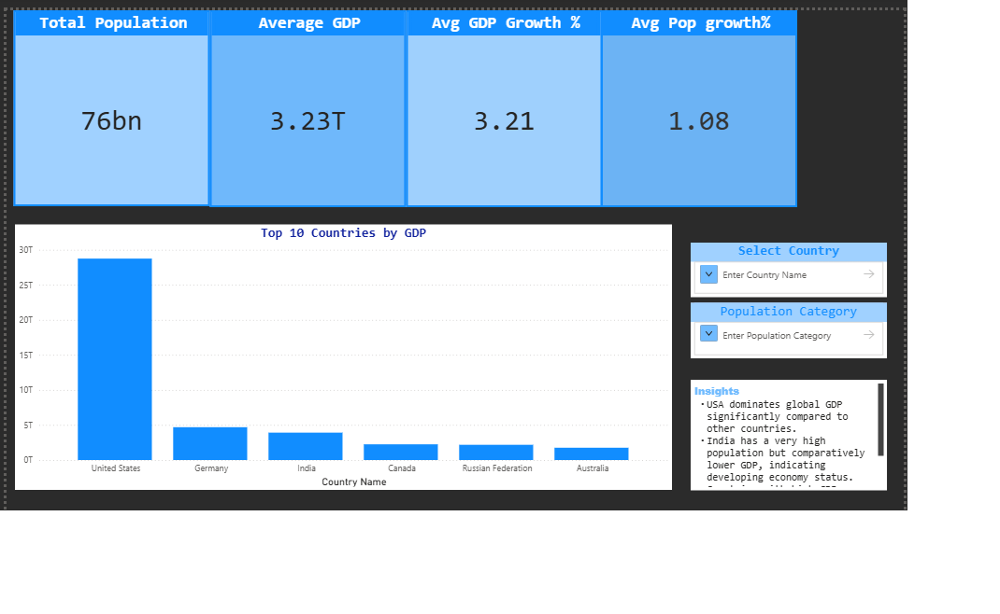

# 🌍 Global Economic & Population Analysis Dashboard

## 📌 Overview

This project analyzes global economic and demographic patterns using Power BI.
It combines multiple datasets from the World Bank to provide insights into population, GDP, and growth trends.

---

## 🎯 Objective

To identify economic strength, population distribution, and growth patterns across countries using interactive visualizations.

---

## 🛠 Tools Used

* Power BI
* Power Query
* DAX
---

## 🔄 Data Preparation

* Extracted data from World Bank datasets
* Cleaned and transformed data using Power Query
* Converted wide format to long format using Unpivot
* Merged multiple datasets using Country and Year

---

## 📊 Dashboard Features

### 🔹 KPIs

* Total Population
* Average GDP
* Average GDP Growth
* Average Population Growth

### 🔹 Visuals

* Top 10 Countries by GDP
* Global Population Map
* Interactive slicers for filtering
---

## 📸 Dashboard Preview

---

## 🔍 Key Insights

* USA dominates global GDP compared to other countries
* India has a very high population but relatively lower GDP
* Developed countries show stable economic growth patterns
---

## 🚀 Outcome

This dashboard enables quick comparison of countries based on economic and demographic indicators and supports data-driven decision making.
