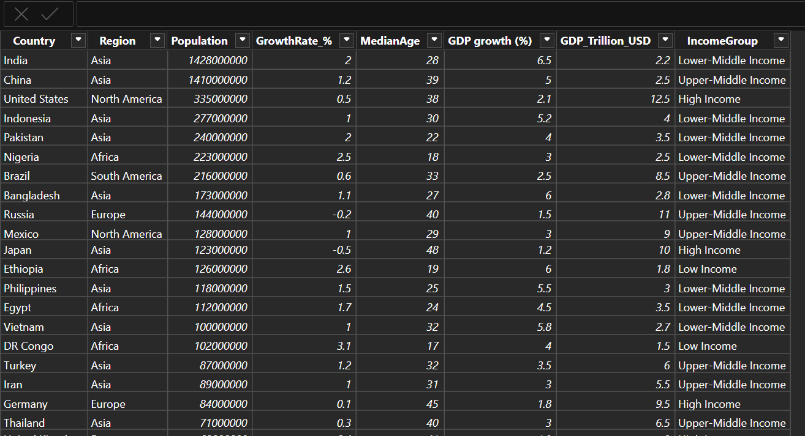

# 🟡 Level 1: Data Basics
This folder contains basic data cleaning tasks in Power BI.
- Checked and corrected data types (numbers, text)
- Renamed columns for better readability
- Replaced inconsistent values (e.g., regions)
- Removed duplicate rows
- Filtered data (Population > 50 million)
- Applied all transformations to load clean dataset

# 🟡 Level 2: Data Visualization
Understand how to represent data visually using charts.
## 📊 Visuals Created
- Bar Chart → Population by Country
- Pie Chart → Population by Region
- Map → Population distribution globally
